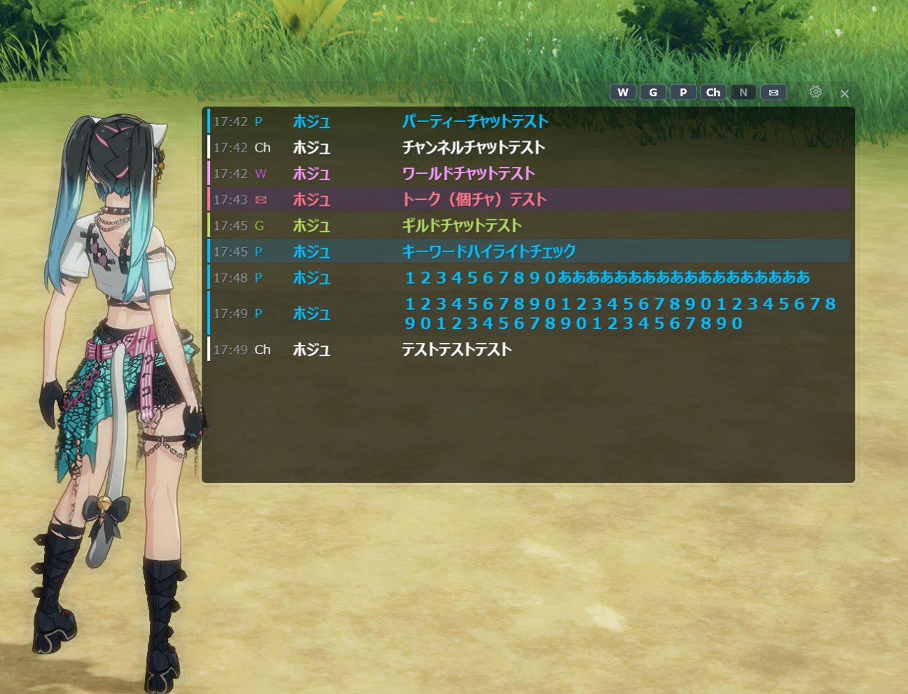
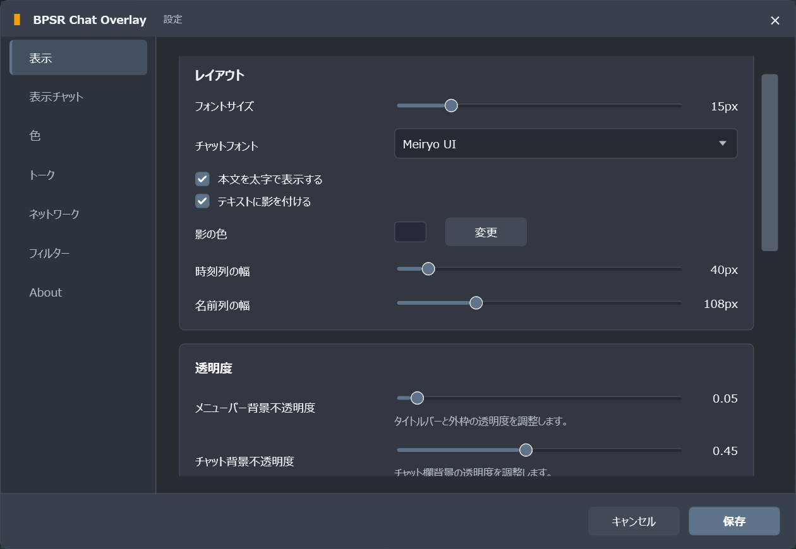
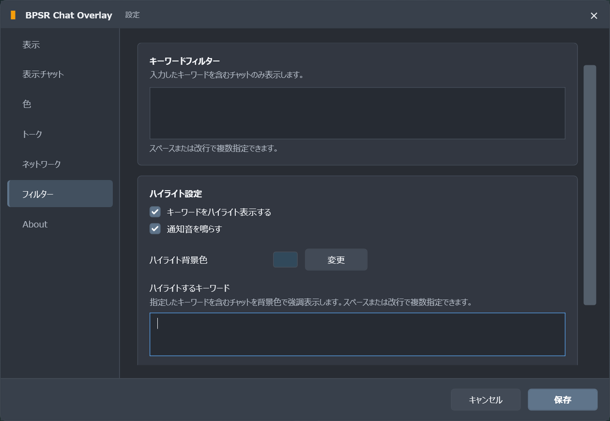

# BPSR Chat Overlay

BLUE PROTOCOL: Star Resonance（ブループロトコル：スターレゾナンス）のゲーム内チャットを、独立したオーバーレイウィンドウへ表示するWindowsアプリケーションです。

ギルドチャットだけを別画面で表示したり、ゲーム内のトーク（個人チャット）を見逃さないようにしたり、プレイスタイルに合わせてチャット表示をカスタマイズできます。

Npcapでゲームの通信を読み取る方式のため、ゲームクライアントへの入力、改造、自動操作は行いません。

BPSR Chat Overlay本体はインストール不要で、管理者権限なしで起動できます。使用するにはNpcapの事前インストールが必要です。

## 主な機能

- ゲーム内チャットのリアルタイム表示
- ワールド、チャンネル、パーティ、ギルド、初心者チャット、トークの表示切り替え
- ゲーム内のトーク表示と、トーク専用の文字色、ハイライト、通知音設定
- チャット種別、キーワードフィルター、ハイライトをOverlay上部のボタンから切り替え
- Overlayの上下左右への画面内収納
- 表示するキーワードによるチャット絞り込み
- 表示しないキーワードによるチャット除外
- キーワードのハイライトと通知音
- Smart Scroll
- チャット種別ごとの文字色設定
- チャットフォント、本文の太字、テキスト影と影色の設定
- 背景、文字、メニューバーの不透明度設定
- 常に最前面表示
- クリック透過
- クリック透過と収納／展開のグローバルホットキー（ショートカットキー）設定
- ゲーム通信やWindowsの経路情報に基づくネットワークカードの自動選択
- GitHub Releasesを利用した正式版の更新確認

表示するチャットは最大500件です。上限を超えた古いチャットは画面から順次削除されます。

## スクリーンショット

※掲載しているスクリーンショットは開発中のものです。現在のバージョンとは一部表示が異なる場合があります。

### Overlay



### 設定画面

表示設定：



フィルター設定：



## 動作環境

- Windows 11（64ビット）
- [Npcap](https://npcap.com/#download)

本アプリを使用する前にNpcapをインストールしてください。Npcapが正しく導入されていない場合、ネットワークカードの一覧取得やパケットキャプチャを開始できません。

## 導入方法

1. [Releases](https://github.com/kanomari/BPSR-Chat-Overlay/releases)から最新版をダウンロードします。
2. ダウンロードしたZIPファイルを任意のフォルダーへ展開します。
3. `BPSRChatOverlay.exe`を起動します。

アプリは二重起動できません。すでに起動している場合は、既存のウィンドウを終了してから起動してください。

## 使い方

1. ゲームを起動してログインします。
2. BPSR Chat Overlayを起動します。
3. タイトルバー右側の歯車ボタンから設定画面を開きます。
4. 「ネットワーク」で、ゲーム通信に使用しているネットワークカードを選択します。
5. 設定を保存し、BPSR Chat Overlayを再起動します。
6. ゲーム内でチャットを受信すると、オーバーレイに表示されます。

ネットワークカードの変更は、次回起動時に反映されます。有線LAN、Wi-Fi、VPNなど複数の候補がある場合は、実際にゲーム通信で使用しているものを選択してください。

### ウィンドウ操作

- タイトルバーをドラッグするとウィンドウを移動できます。
- ウィンドウの端をドラッグするとサイズを変更できます。
- 歯車ボタンで設定画面を開きます。
- `×`ボタンで終了します。
- `W`、`G`、`P`、`Ch`、`N`、`✉`ボタンで、各チャット種別の表示を切り替えます。
- 初期設定では`Ctrl` + `Shift` + `F10`でクリック透過の有効・無効を切り替えます。
- 初期設定では`Ctrl` + `Shift` + `F9`でOverlayを収納・展開します。

クリック透過を有効にすると、マウス操作が背後のゲームへ渡されます。ウィンドウを操作できなくなった場合は、設定しているクリック透過切替ホットキー（初期設定：`Ctrl` + `Shift` + `F10`）で解除してください。

ホットキーは「システム ＞ ホットキー」から変更できます。クリック透過切替は必須です。収納／展開切替は未設定にできます。

### Smart Scroll

- 最新メッセージを表示している間は、新着チャットへ自動スクロールします。
- 上へスクロールすると自動スクロールを停止します。
- 自動スクロール停止中に表示対象の新着チャットを受信すると、「↓ 新着メッセージあり」ボタンを表示します。
- ボタンを押すか自分で最下部へ戻ると、自動スクロールを再開します。

## 設定

### 表示

- フォントサイズ
- チャットフォント、本文の太字
- テキスト影と影色
- 時刻列と名前列の幅
- チャット背景、文字、メニューバーの不透明度
- 常に最前面
- クリック透過
- 新着チャットの強調
- 区切り線、交互背景、チャット種別の色帯
- Overlayチャット切り替えボタン
- デバッグ用通信確認パネル

### 表示チャット

表示対象とするチャット種別を選択できます。

### 色

各チャット種別の文字色、チャット背景色、メニュー背景色を変更できます。

### トーク

トーク専用のハイライト背景色と通知音を設定できます。トークはキーワードフィルター、キーワードハイライト、キーワード通知音の対象外です。

### フィルター

- 表示するキーワード：指定したキーワードを本文または発言者名に含むチャットだけを表示します。
- 表示しないキーワード：指定したキーワードを本文に含むチャットを表示しません。必要に応じて発言者名も対象にできます。
- キーワードハイライト：指定したキーワードを含むチャットを強調します。
- 通知音：ハイライト対象を受信したときに音声ファイルを再生します。

キーワードはスペースまたは改行で複数指定できます。

「表示しないキーワード」はキーワードフィルターのON/OFFに関係なく常に適用されます。「表示するキーワード」と両方に一致した場合は、「表示しないキーワード」が優先されます。表示しないキーワードに一致したチャットでは、ハイライト通知音も再生されません。

トークは、表示するキーワード、表示しないキーワード、キーワードハイライトの対象外です。

## データ保存先

設定とログは、次のフォルダーへ保存されます。

```text
%LOCALAPPDATA%\BPSR Chat Overlay
```

主なファイル：

```text
config.json          設定
config.json.bak      設定のバックアップ
Logs\                ログ
```

ログは日単位および10 MiB単位でローテーションされ、7日を超えたファイルは削除されます。

不具合を報告する際はログが調査に役立ちます。ただし、第三者へ送付する前に内容を確認してください。

## トラブルシューティング

### ネットワークカードが表示されない

- Npcapがインストールされているか確認してください。
- Npcapをインストールした直後の場合は、Windowsを再起動してください。
- 設定画面の「ネットワーク」で「再読み込み」を実行してください。

### チャットが表示されない

1. ゲームで使用しているネットワークカードが選択されているか確認します。
2. ネットワークカードを変更した場合は、アプリを再起動します。
3. 設定のチャット種別とキーワードフィルターを確認します。
4. デバッグ用通信確認パネルを有効にして、Npcap取得パケット数が増えているか確認します。
5. `%LOCALAPPDATA%\BPSR Chat Overlay\Logs`のログを確認します。

VPNや仮想ネットワークアダプターを使用している場合、ゲーム通信が通常とは異なるネットワークカードを通ることがあります。

### ウィンドウをクリックできない

クリック透過が有効になっています。設定しているクリック透過切替ホットキー（初期設定：`Ctrl` + `Shift` + `F10`）を押して解除してください。

### 修飾キーなしのホットキーがゲーム中に反応しない

ゲーム側のキー設定や入力処理との組み合わせにより、修飾キーなしのホットキーがゲーム中に反応しない場合があります。

ホットキーには、`Ctrl`、`Shift`、`Alt`のいずれかを組み合わせて設定することをおすすめします。

### 設定を初期化したい

アプリを終了してから、次のファイルを別の場所へ移動するか削除してください。

```text
%LOCALAPPDATA%\BPSR Chat Overlay\config.json
```

次回起動時に既定の設定が作成されます。正常なバックアップが残っている場合は、バックアップから復旧されることがあります。完全に初期化する場合は`config.json.bak`も対象にしてください。

## 動作上の注意

- 動作環境やゲーム側の更新によって、チャットを取得できない場合があります。
- すべてのPC、ネットワーク構成、ゲーム提供地域での動作を保証するものではありません。
- 過負荷時はメモリ使用量の増加を防ぐため、Npcapで取得したコピーのうち、本アプリ内部で解析待ちになっているデータの一部を破棄することがあります。PCやゲームが送受信する通信データには影響しません。

## 開発者向け

### 必要な環境

- Windows 11
- .NET 9 SDK
- Npcap
- Visual Studio 2022、Visual Studio Code、または.NET CLI

### ビルド

```powershell
git clone https://github.com/kanomari/BPSR-Chat-Overlay.git
cd BPSR-Chat-Overlay
dotnet restore
dotnet build BPSRChatOverlay.slnx --configuration Debug
```

Releaseビルド：

```powershell
dotnet build BPSRChatOverlay.slnx --configuration Release
```

## プライバシーと免責事項

本アプリは、チャット表示のためにローカルPC上のネットワーク通信をキャプチャして解析します。ゲームクライアントへパケットを送信したり、ゲームを操作したりする機能はありません。

本プロジェクトは非公式のファンメイドツールです。ゲームの開発元・運営元・販売元とは関係がなく、それらによる承認や支援を受けたものではありません。

利用者自身の責任で使用してください。利用前に、適用されるゲームの利用規約や地域の法令を確認してください。

## ライセンス

本プロジェクトは[MIT License](LICENSE)の下で公開されています。

パケットキャプチャ、TCP再構築、ネットワークプロトコル処理の一部には、BPSR-ZDPS由来のコードが含まれています。詳細は[THIRD_PARTY_NOTICES.md](THIRD_PARTY_NOTICES.md)を参照してください。
